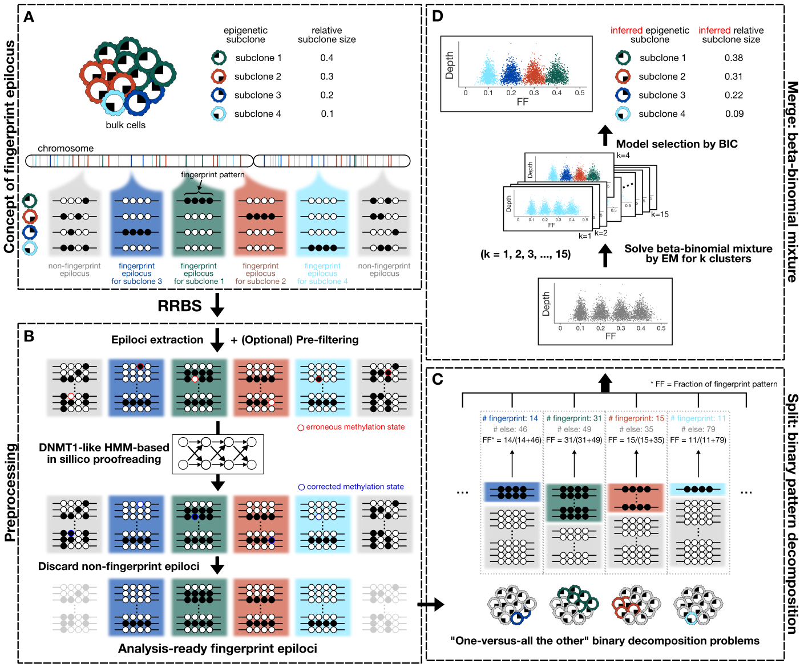
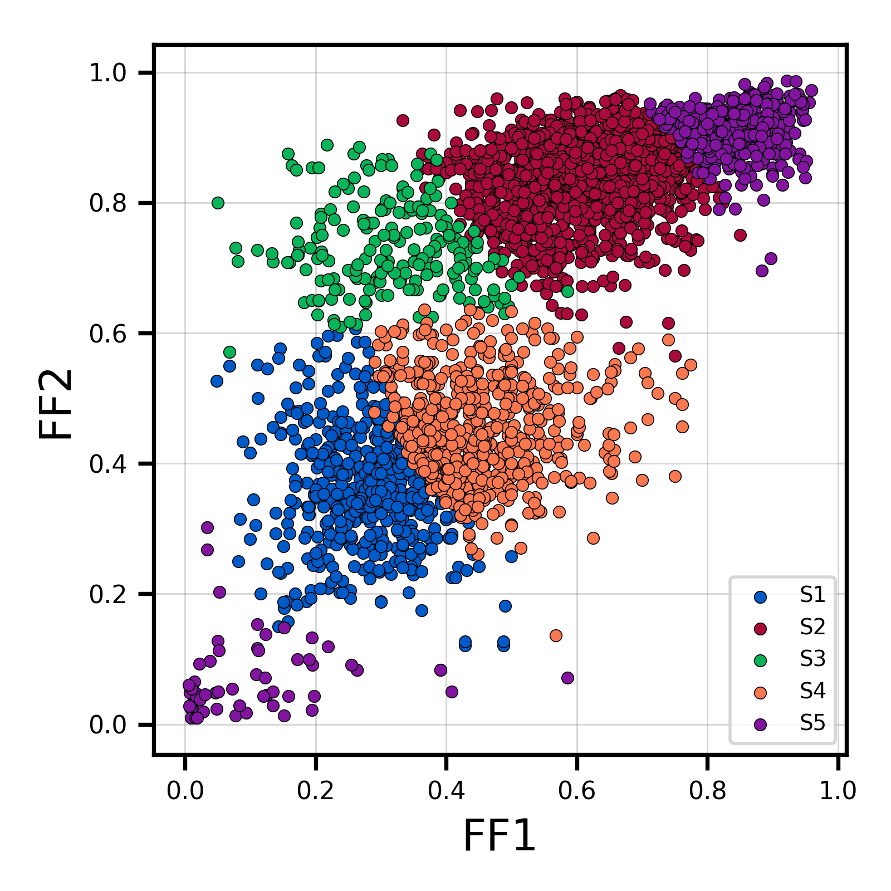
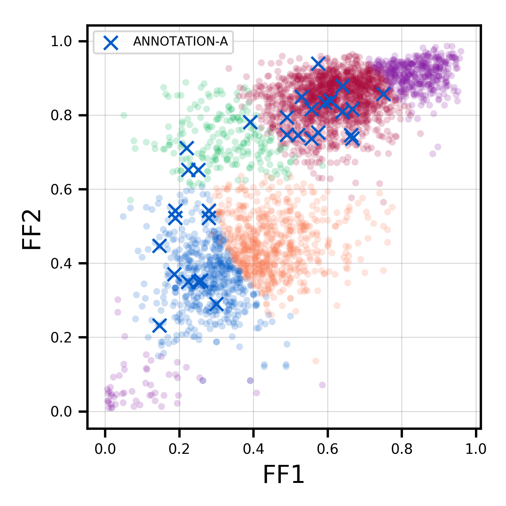

<p align="center"></p>
<p align="center">Methylation <b>P</b>attern-based, <b>R</b>eference-free <b>I</b>nference of <b>S</b>ubclonal <b>M</b>akeup. (vv1.0.0.)</p>
<p align="center">
  <a href="https://subclone-prism.readthedocs.io/en/latest/"></a>
  <a href="https://pypi.python.org/pypi/"></a>
  <a href="https://travis-ci.org/dohlee/prism"></a>
</p>


<h2 align="center">Prerequisites</h2>

- **BAM file of RRBS reads, aligned by Bismark.**

PRISM requires the mapping result of [Bismark](https://www.bioinformatics.babraham.ac.uk/projects/bismark/), a bisulfite read mapping tool. Also note that PRISM only applies to RRBS data, and unfortunately, the feasibility of PRISM to the data from other methylation profiling techniques such as whole genome bisulfite sequencing (WGBS), methylated DNA immunoprecipitation sequencing (MeDIP-Seq), or methyl-CpG binding domain-based capture sequencing (MBDCap-Seq) has not been verified.

<h2 align="center">Installation</h2>

PRISM can be installed via PyPI.

```bash
pip install subclone-prism
```

<h2 align="center">Documentation</h2>

Simple quick-start usage can be found below. If your are interested, please refer to the [full documentation](https://subclone-prism.readthedocs.io/en/latest/).

<h2 align="center">Usage</h2>



The PRISM analysis is done in three steps: `extract` - `preprocess` - `deconvolute`.

## Quickstart

```bash
# Extract epiloci from BAM file.
prism extract -i sample.bam -o sample.met

# Preprocess epiloci to get finer estimates of epigenetic subclones
# and to increase the number of fingerprint epiloci.
prism preprocess -i sample.met -o sample.corrected.met

# Infer the subclonal composition of the sample.
# 1-sample deconvolution.
prism deconvolute -i sample.corrected.met -o sample.prism.result
# 2-sample deconvolution.
prism deconvolute -i sample1.corrected.met sample2.corrected.met -o sample.prism.result

# Scatterplot for visualization of the result.
prism scatter -i sample.prism.result -o sample.png

# Annotation of fingerprint epiloci for functional characterization of
# discovered epigenetic subclones.
prism annotate -i sample.prism.result -o sample.prism.annotated.result \
--beds annotation_a.bed annotation_b.bed \
--annotation-names ANNOTATION-A ANNOTATION-B
```

## extract

`prism extract` command extracts viable epiloci from a BAM file.
In other words, it extracts genomic regions harboring a sufficient number of mapped reads (>= d) with a sufficient number of CpGs (>= c).
A resulting file with those epiloci information is generated, whose file extension will be `.met` afterwards.
To extract epiloci with default settings (d = 20, c = 4), simply run the command below:

```bash
prism extract -i sample.bam -o sample.met
```

If you want to specify your own cutoffs for the required sequencing depth and the number of CpGs, say, d = 15 and c = 3, run as follows:

```bash
prism extract -i sample.bam -o sample.met -d 15 -c 3
```

Note that depending on the reference genome used, you may have to specify `-u/--prepend-chr` option.
Also, you should use `-x/--paired` option to inform PRISM that you are using paired-end sequencing data.
For a more detailed description about all options, run `prism extract -h`.

## preprocess

`prism preprocess` command corrects for the errors in methylation patterns in order to amplify the number of *fingerprint epiloci* and calibrate for the subclone size estimates.

```bash
prism preprocess -i sample.met -o sample.corrected.met
```

You may benefit from multithreading with `-t/--threads` option.

```bash
prism preprocess -i sample.met -o sample.corrected.met -t 30
```

This step is resource intensive, so by default PRISM tries to pre-filters the epilocus that is not likely to be a fingerprint epilocus.
This pre-filtering of course can be turned off by `-f/--no-prefilter` option and this indeed gives a better estimates of subclones.
However, please be warned, depending on your data size, this step will last long.
To help you deciding whether or not to apply prefiltering, with 30 threads (`-t 30`) ~200M met file took about 5 hours to be preprocessed without prefiltering.

```bash
prism preprocess -i sample.met -o sample.corrected.met --no-prefilter -t 30
```

For a more detailed description about all options, run `prism preprocess -h`.

## deconvolute

`prism deconvolute` command infers the subclonal composition of the sample. Simply give methylation pattern-corrected epiloci file.

```bash
prism deconvolute -i sample.corrected.met -o sample.prism.result
```

Another feature of PRISM is that it can utilize two or more samples from a single tumor at the same time, and jointly infer subclonal composition. To provoke joint-analysis, specify a list of `corrected.met` files.

```bash
prism deconvolute -i sample1.corrected.met sample2.corrected.met -o sample.prism.result
```

For a more detailed description about all options, run `prism deconvolute -h`.


## scatter

`prism scatter` command generates a scatterplot of the PRISM analysis result. 
You need a result of `prism deconvolute`.
The dimension of anlaysis (i.e., the number of samples you gave to `prism deconvolute` command) should not be more than three to visualize it.
Note that the file extension of output file should be a general one for image files such as png, jpg, or pdf.

```bash
prism scatter -i sample.prism.result -o sample.png
```

<p align="center"></p>

## annotate

`prism annotate` command does functional annotation of the PRISM analysis result.
It requires collections of genomic intervals as BED files. Give one or more BED file to `prism annotate`, with representative annotation term for each BED file.
Basically it generates annotated result, with an additional column having comma-separated terms that the epiloci is annotated to.

```bash
prism annotate -i sample.prism.result -o sample.prism.annotated.result --beds annotation_a.bed annotation_b.bed --annotation-names ANNOTATION-A ANNOTATION-B
```

To extract epiloci with specific annotation term, use the command below.

```bash
cat sample.prism.annotated.result | grep 'ANNOTATION-A'
```

Also, scatterplots with annotation can be generated with `--figure` option.

```bash
prism annotate -i sample.prism.reslt -o sample.prism.annotated.result --beds annotation_a.bed annotation_b.bed --annotation-names ANNOTATION-A ANNOTATION-B --figure sample.prism.annotated.png
```

<p align="center"></p>